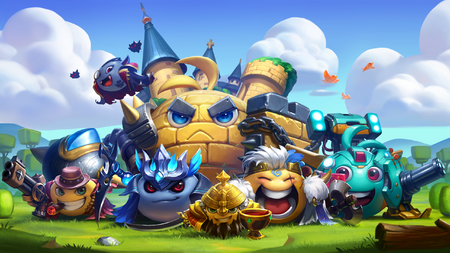

# Gumballs & Dungeons Review
## Ferdiansyah
## 3145141980

Gumballs dan Dungeons salah satu permainan dengan karakter kartun berbentuk slime, karakter gumball yang imut dan elemen fantasi yang lebih realistis. Mungkin permainan ini, terlihat hanya seperti permainan yang menampilkan karakter-karakter lucu, tetapi tidak demikian. Gumballs & Dungeons memberikan begitu banyak hal yang bisa kita dapatkan seperti pada game RPG pada umumnya, namun dengan berbagai unsur yang menarik dan membuat pemainnya menjadi sangat adiktif.

Permainan Gumballs & Dungeons ini dapat diunduh gratis di Google Play Store dan iOS. Walaupun gratis tetapi game ini harus membayar beberapa kebutuhan tertentu untuk membuat karakter gumball semakin baik. Namun, jika kita serius memainkannya maka kita tidak membutuhkan uang untuk memainkannya dan disitulah letak keseruannya.

Gumballs & Dungeons dikembangkan oleh perusahaan QCPlay. Game ini merupakan game strategi petualangan , kita memulai dengan satu gumball yaitu Adventurer Gumball lalu pergi berpetualang ke berbagai tempat untuk menemukan Gumball yang lain dan mendapatkan berbagai macam koleksi.

## GamePlay

Core gameplay dari Gumballs & Dungeons adalah penjelajahan dungeon, dan game ini identik dengan game Dungelot. Setiap lantai dungeon ditutupi ubin atau papan tulis(slate) yang saling terhubung satu sama lain dalam grid-grid. Dari pintu masuk lantai, pemain harus membersihkan slate ini dengan mengetuknya untuk membuka apa yang mungkin ada di bawahnya bisa item, event, dan bahkan musuh. Tujuan di setiap lantai adalah untuk menemukan kunci yang akan membuka lantai berikutnya, turun sampai lantai akhir dimana boss harus dikalahkan.

Meski tidak seperti game bergenre rogue-like, ada beberapa elemen rogue-like sangat familiar. Dungeons dibuat sangat acak, terutama di endless mode. Karakter - Gumballs, harus menyesuaikan diri setiap kali memasuki ruang dungeon, membuat kemajuan saat berada di dalam dungeon menjadi agar berjalan lancar. Menemukan dan mendapatkan upgrade yang permanen memungkinkan gumball memiliki kesempatan bertahan lebih baik dalam jangka waktu berikutnya. Gumballs juga berkembang di setiap deungon dengan membuka "title", yang memberikan buff atau kemampuan khusus selama jangka waktu tersebut.

Gumballs & Dungeos juga dilengkapi dengan fitur idle, dimana pemain memungkinkan mendapatkan gold dan sumber daya selama pemain tersebut tidak sedang memainkan game. Dari sumber daya dan gold tersebut dapat dibuat sebuah potion atau peralatan yang bisa kita bawa ke dungeon untuk membantu meningkatkan gumball. 

